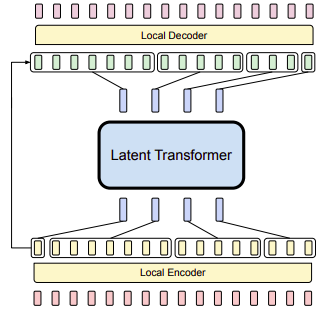

# Model

## Architecture

We will use a variant of the [Byte Latent Transformer](https://arxiv.org/abs/2412.09871) (BLT) architecture. The BLT architecture is a transformer-based model that is designed to process sequences of bytes efficiently. It is particularly well-suited for our use case as it can process the raw bytes of the candlestick data directly without any preprocessing.

It consists of a 3 stages pipeline:
* Local Encoder: A small transformer encoder that consumes all the data related to a candlestick and produces a latent representation.
* Latent Transformer: A transformer that consumes autoregressively the latent representations and produces a distribution latent representation.
* Local Decoder: A small transformer decoder that consumes the distribution latent representation and produces autoregressively a sampling of the next candlestick.

*N.B.*: We use abusively the term transformer to refer to any backbone that can process sequences autoregressively like transformers, state-space models, causal convolutions, etc.

## Tokenizer

A candlestick contains 5 values:
* Open price (float32)
* High price (float32)
* Low price (float32)
* Close price (float32)
* Volume (float32)

Which consists of 5 float32 values or 20 bytes. Thus we can represent this data with a sequence of 20 tokens over a vocabulary of size 256. Optionally, a Byte Pair Encoding (BPE) stage can be added to the tokenizer to reduce the sequence length by using a bigger vocabulary. The downside of this approach is that the sequence length will no longer be fixed and padding will be required.

## Local Encoder

Token sequences are processed by a small transformer encoder followed by global pooling to get a latent representation of the candlestick. This representation can then be utilized by the later stages of the pipeline for autoregressive prediction. Unlike other parts of the pipeline, the local encoder is not autoregressive which means that each token can attend to all the other tokens.

## Latent Transformer

The latent transformer is the core of the model and is responsible for consuming the latent representations produced by the local encoder to produce a distribution latent representation. This block is a typical transformer or any kind of LLM backbone enjoying all recent advances in LLMs.

Furthermore, in addition to the candlesticks it processes autoregressively, some context tokens can be prepended to the input sequence to provide additional information to the model. The kind of context tokens can be:
* Pair name: The name of the pair the model is processing.
* Timeframe: The timeframe of the candlestick the model is processing.

## Local Decoder

The local decoder is responsible for consuming the distribution latent representation produced by the latent transformer and producing autoregressively the next candlestick using auto-regressive sampling. This block is similar to the local encoder but is autoregressive and each token can only attend to the distribution latent representation as well as the tokens that have been produced before.